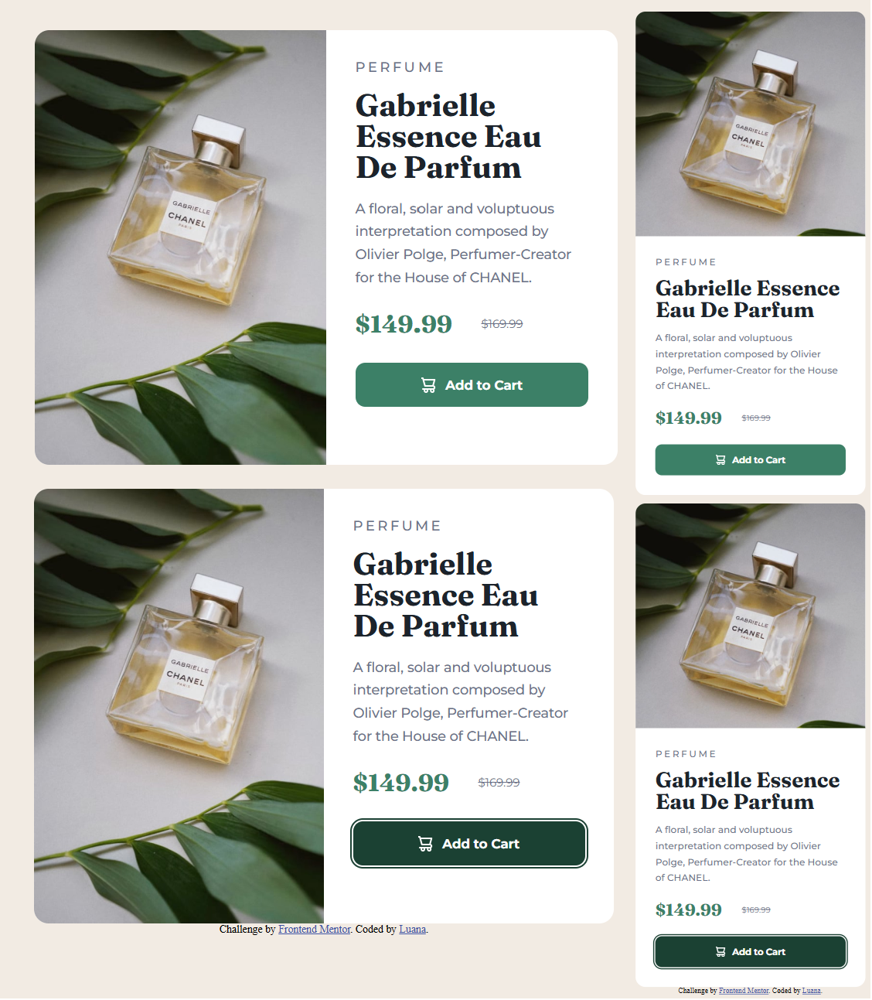

# Product Preview Card

Este projeto é uma solução para o desafio [Product Preview Card Component](https://www.frontendmentor.io/challenges/product-preview-card-component-GO7UmttRfa) do Frontend Mentor.

## Screenshot

## Sobre o projeto

Um cartão de visualização de produto responsivo, desenvolvido com HTML e CSS a partir do design proposto pelo Frontend Mentor.

O projeto inclui:

* Layout responsivo para desktop e dispositivos móveis
* Imagem responsiva utilizando a tag `<picture>`
* Fontes personalizadas do Google Fonts
* Estados de hover e focus no botão
* Estrutura HTML semântica

## Tecnologias

* HTML5
* CSS3
* Flexbox
* Design responsivo
* Google Fonts

## Links

* [Projeto online](https://product-preview-card-rosy-six.vercel.app/)
* [Desafio no Frontend Mentor](https://www.frontendmentor.io/)

## O que aprendi

Este projeto me ajudou a praticar layouts responsivos, Flexbox, o uso da tag `<picture>` para imagens responsivas, variáveis CSS e estados interativos de botões.

## Autora

**Luana**

* GitHub: [@luanarb](https://github.com/luanarb)
